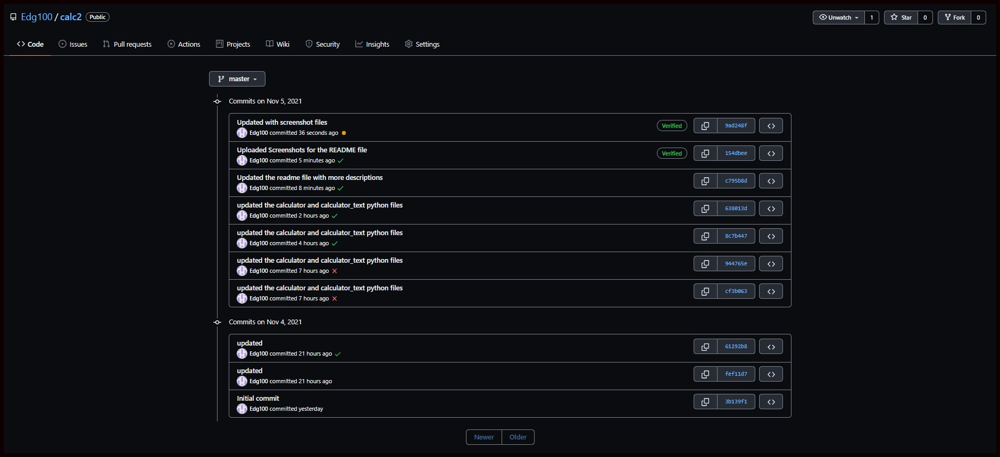

# Calculator Project Setup Part 2

## By Edgardo Guillen

## Travis Badge

## Coverage Badge

## Repository In Travis

## Pytest In The Terminal

## PyLint Test In The terminal

## History of Commits

### Configurations And File Descriptions Used In The Calculator Part 2 Project

Run Pip Install
pip install -r requirements.txt

To run tests, Lint, and Coverage report use this command:

pytest  --pylint --cov

.pylintrc is the config for pylint
.coveragerc is the config for coverage
setup.py is a config file for pytest
