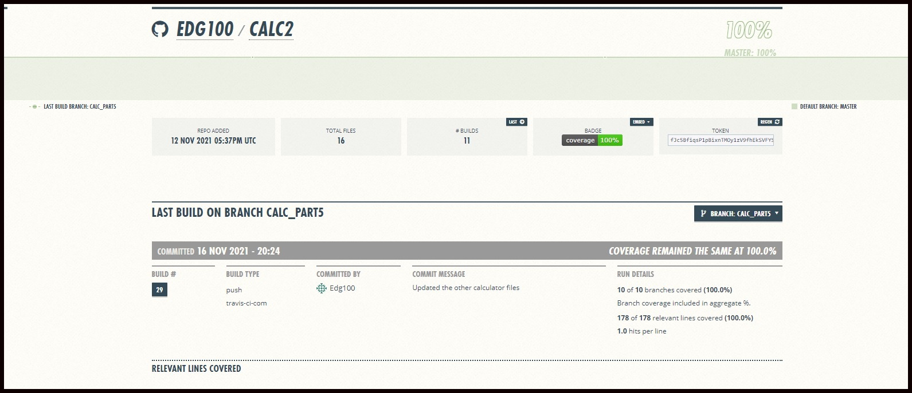

# Refactor Assigment using Tuple

## By Edgardo Guillen

## Travis Badge

## Coverage Badge

## Repository In Travis

## Coveralls for the branch

## Pytest In The Terminal

## PyLint Test In The terminal

## History of Commits

### Configurations And File Descriptions

Run Pip Install
pip install -r requirements.txt

To run tests, Lint, and Coverage report use this command:

pytest  --pylint --cov

.pylintrc is the config for pylint
.coveragerc is the config for coverage
setup.py is a config file for pytest
